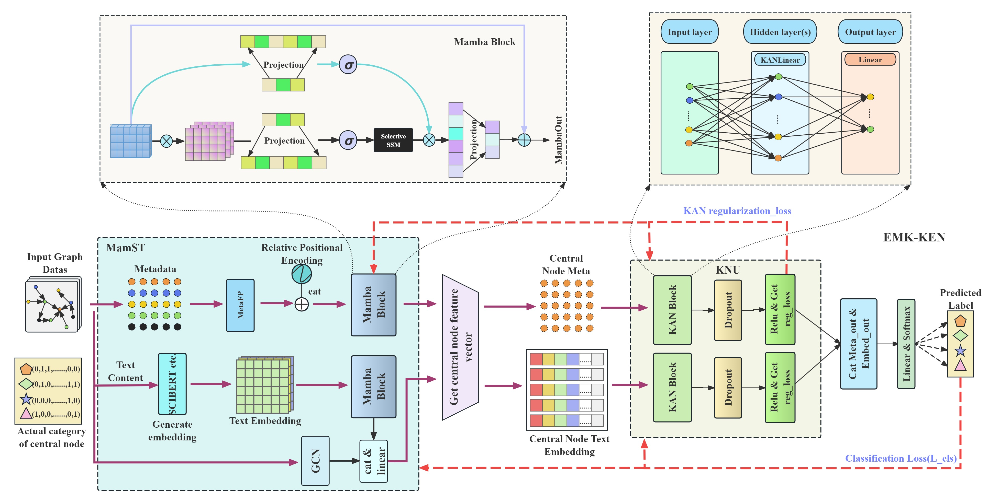

<h2 align="center">✨EMK-KEN: A High-Performance Approach for Assessing Knowledge Value in Citation Network</h2>

<p align="center">
  <!-- arXiv Badge -->
  <a href="https://arxiv.org/abs/2502.15704" target="_blank">
    
  </a>
  <!-- Contact Badge -->
  <a href="mailto:liuchengzhi@email.swu.edu.cn" target="_blank">
    
  </a>
</p>

## Overview🔍


This is the github repo for the paper ["EMK-KEN: A High-Performance Approach for Assessing Knowledge Value in Citation Network"](https://arxiv.org/abs/2502.15704).
By integrating Mamba and KAN architectures, the model addresses the inefficiency and poor generalization of traditional methods in large-scale networks. The framework consists of two key modules:

- Semantic Feature Extraction: MetaFP and Mamba process metadata and long-sequence text embeddings to learn contextual representations.
- Structural Information Capture: KAN leverages structural differences across domains to model complex dependencies in citation networks.

Extensive experiments on 10 benchmark datasets demonstrate that EMK-KEN not only outperforms state-of-the-art models (e.g., GAT, Transformer) in accuracy, F1-score, and AUC but also shows remarkable efficiency. Efficiency analysis experiments validate the model's faster inference capability, making it highly suitable for large-scale applications. Additionally, the model exhibits stronger robustness across diverse datasets, ensuring stable performance even under varying conditions. Ablation studies confirm the necessity of components (e.g., causal convolution, SSMs), while hyperparameter analysis highlights tunable sensitivity. This work provides a powerful tool for literature analysis and knowledge mining, with potential extensions to broader knowledge evaluation tasks.
## Datasets📚
To validate our EMK-KEN approach for assessing knowledge value in citation networks, we conducted experiments across ten diverse academic datasets. These datasets span multiple disciplines, including computer science, biomedicine, social sciences, and high-energy physics, ensuring a thorough evaluation of the model's multi-domain adaptability ability.

| Dataset               | Domain              | Key Features                                                               | Nodes    | Edges      | Features per Node  |
| --------------------- | ------------------- | -------------------------------------------------------------------------- |----------| ---------- |--------------------|
| DBLP-V13              | Computer Science    | Bibliographic metadata of publications and citations                       | 535,4309 | 48,277,950 | 768                |
| Citation Networks-V12 | Computer Science    | Citation relationships and publication metadata                            | 489,4081 | 45,564,149 | 769                |
| ACMHypertextECHT      | Computer Science    | Proceedings of ACM Hypertext conferences                                   | 728      | 5,326      | 771                |
| OGBN-ArXiv            | Computer Science    | ArXiv dataset for node property prediction                                 | 169,343  | 1,166,243  | 128                |
| ALTEGRADChallenge2021 | Computer Science    | Challenge dataset from ALTEGRAD lab                                        | 100,336  | 2,633,688  | 768                |
| AMN                   | Computer Science    | Artificial Intelligence, Machine Learning, and Natural Language Processing | 60,646   | 264,505    | 772                |
| Oxytocin              | Biomedicine         | Citation network related to oxytocin research                              | 1,467    | 86,535     | 770                |
| Biomedicine           | Biomedicine         | Bioinformatics, Biotechnology, and Physiology subfields                    | 31,546   | 211,883    | 772                |
| SNAP-HEP-TH           | High-Energy Physics | Citation network in high-energy physics                                    | 27,770   | 352,807    | 768                |
| ACMIS                 | Social Sciences     | ACM Information Systems conference series data                             | 1,6148   | 128,027    | 768                |

## Installation🚀
EMKKEN can be installed directly from GitHub.

**Pre-requisites:**

```
Python 3.8.18 or higher
```

**For developers**

```
git clone https://github.com/naipings/EMKKEN.git
cd EMKKEN
pip install -e .
```

**Installation via github**

```
pip install git+https://github.com/naipings/EMKKEN.git
```

Requirements

```python
# python==3.8.18
imbalanced_learn==0.12.3
imblearn==0.0
langdetect==1.0.9
mamba_ssm==2.2.2
matplotlib==3.7.5
networkx==3.1
nltk==3.8.1
numpy==1.24.3
optuna==3.6.1
pandas==2.0.3
scikit_learn==1.3.2
seaborn==0.13.2
torch==2.2.0
torch_geometric==2.6.1
transformers==4.43.3
```

After activating the virtual environment, you can install specific package requirements as follows:
```python
pip install -r requirements.txt
```

Other requirements:
- Linux
- NVIDIA GPU
- PyTorch 1.12+
- CUDA 11.6+

**Optional: Conda Environment Setup**
For those who prefer using Conda:
```
conda create --name emkken-env python=3.8.18
conda activate emkken-env
pip install git+https://github.com/naipings/EMKKEN.git  # For GitHub installation
```

